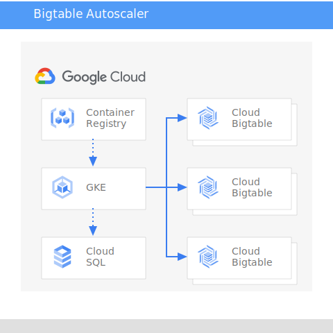

# Bigtable autoscaler Deployment

## General

In this guide we will deploy Bigtable auto-scaler into GKE.



## Getting started

### Prerequisites

* Bigtable cluster (or several) to autoscale
* GKE cluster
* Service account JSON key that has relevant access to the Bigtable clusters to autoscale.
  * If the autoscaler is running in the same GCP project as all the Bigtable clusters, the Compute Engine Default Service Account is sufficient.
  * The minimum permissions are:
    * Role Bigtable Administrator, in particular the permissions
      * bigtable.clusters.get
      * bigtable.clusters.update
    * Role Monitoring Viewer, in particular the permissions
      * monitoring.timeSeries.list
* Docker
* Java 11 and maven
* PostgreSQL database
* gcloud

### Set the environment

* Set some variables

```bash
export PROJECT_ID=(YOUR PROJECT ID)
export PROJECT_NUMBER=(YOUR PROJECT NUMBER)
export REGION=(REGION IN WHICH THINGS WILL BE DEPLOYED)
export ZONE=(ZONE IN WHICH THINGS WILL BE DEPLOYED)
export DB_INSTANCE_NAME=(NAME FOR POSTGRESQL INSTANCE)
export DB_PASSWORD=(CRAZY COMPLICATED PASWORD FOR THE DB)
export SERVICE_ACCOUNT_NAME="bigtable-autoscaler"
export DB_CONNECTION_NAME=${PROJECT_ID}:${REGION}:${DB_INSTANCE_NAME}
export BIGTABLE_INSTANCE_NAME=(Bigtable instance name)
export BIGTABLE_CLUSTER_ID=(Bigtable cluster name)
```

### Set the Postgres DB

* Set CloudSQL with Postgres

```bash
gcloud sql instances create ${DB_INSTANCE_NAME} \
--database-version=POSTGRES_9_6 \
--cpu=1 \
--memory=3.75GB \
--region=${REGION}
```

* Generate and set a password for the DB

```bash
gcloud sql users set-password postgres \
--instance=${DB_INSTANCE_NAME} \
--password=${DB_PASSWORD}
```

* Init the DB and schema
  * DB name: autoscale
  * DB Schema: [src/main/resources/schema.sql](https://github.com/spotify/bigtable-autoscaler/blob/master/src/main/resources/schema.sql)
* Enable cloudSQL admin API: [https://console.developers.google.com/apis/api/sqladmin.googleapis.com/overview?project=<PROJECT_NUMBER>](https://console.developers.google.com/apis/api/sqladmin.googleapis.com/overview?project=<PROJECT_NUMBER>)

### Build the image

* Build the image as described in the main README file. Make sure you psh it to the right container registry (should look similar to us.gcr.io/${PROJECT_ID}/bigtable-autoscaler).

### Set GKE environment

* We will use [Cloud SQL Proxy](https://cloud.google.com/sql/docs/mysql/sql-proxy) to connect the auto-scaler container to the Postgres DB. Cloud SQL Proxy provides secure access to your instances without the need for Authorized networks or for configuring SSL. The next steps follows the instructions in [this article](https://cloud.google.com/sql/docs/postgres/connect-kubernetes-engine#providing_the_service_account_to_the_proxy)
  * Create a GCP service account "bigtable-autoscaler"
    * Add "Bigtable Administrator" role
    * Add "Cloud SQL Client" role
    * Add "Service Management Administrator" role
    * Add "Service Controller" role

    ```bash
    gcloud iam service-accounts create ${SERVICE_ACCOUNT_NAME} \
    --description="Service account got GKE to manage Bigtable"
    --display-name=${SERVICE_ACCOUNT_NAME}

    gcloud iam service-accounts add-iam-policy-binding ${SERVICE_ACCOUNT_NAME} --role='roles/bigtable.admin'
    gcloud iam service-accounts add-iam-policy-binding ${SERVICE_ACCOUNT_NAME} --role='roles/cloudsql.client'
    gcloud iam service-accounts add-iam-policy-binding ${SERVICE_ACCOUNT_NAME} --role='roles/servicemanagement.admin'
    gcloud iam service-accounts add-iam-policy-binding ${SERVICE_ACCOUNT_NAME} --role='roles/servicemanagement.serviceController'
    ```

  * Create kubernetes service account

    ```bash
    kubectl apply -f ./yaml/service_account.yaml
    ```

  * Enable the IAM binding

    ```bash
    gcloud iam service-accounts add-iam-policy-binding \
    --role roles/iam.workloadIdentityUser \
    --member "serviceAccount:${PROJECT_ID}.svc.id.goog[default/bigtable-autoscaler]" \
    ${SERVICE_ACCOUNT_NAME}@${PROJECT_ID}.iam.gserviceaccount.com
    ```

  * Add an annotation

    ```bash
    kubectl annotate serviceaccount \
    bigtable-autoscaler \
    iam.gke.io/gcp-service-account=bigtable-autoscaler@${PROJECT_ID}.iam.gserviceaccount.com
    ```

* Create the DB secrets
This is not tne best way. You might want to look at the [Things to think about](https://github.com/yorambenyaacov/bigtable-autoscaler-deplymnet#things-to-think-about) section for a better ideas...

```bash
kubectl create secret generic postgresql-info \
--from-literal=username=postgres \
--from-literal=password=${DB_PASSWORD}
```

* Deploy bigtable autoscaler

**Update PROJECT_ID & DB_CONNECTION_NAME in bigtable-autoscaler.yaml and apply the yaml**  
DB_CONNECTION_NAME was already defined previosly but you can get it also from the GCP console or usign gcloud `gcloud sql instances describe <DB_INSTANCE_NAME> | grep connectionName`

```bash
kubectl apply -f ./yaml/bigtable-autoscaler.yaml
```

* Deploy bigtable autoscaler service

```bash
kubectl apply -f ./yaml/bigtable-autoscaler-service.yaml
```

### Bigtable (Optional. Just incase a test cluster is needed)

* Create a bigtable instance with the next settings:
  * Storage: SSD
  * Region: ${REGION}
  * Number of nodes: 1

  ```bash
  gcloud bigtable instances create ${BIGTABLE_INSTANCE_NAME} --cluster="$BIGTABLE_INSTANCE_NAME-c1" --cluster-zone=ZONE --cluster-num-nodes=1
  ```

* Enable Cloud Bigtable Admin API: [https://console.developers.google.com/apis/api/bigtableadmin.googleapis.com/overview?project=<PROJECT_NUMBER>](https://console.developers.google.com/apis/api/bigtableadmin.googleapis.com/overview?project=<PROJECT_NUMBER>)

### Connect the dots

* Set some env variable
  * AUTO_SCALER={YOUR SERVICE IP}

```bash
AUTO_SCALER=<GKE_LB_SERVICE_IP>
```

* Check that the service is up and running

```bash
curl -v -X GET "http://${AUTO_SCALER}:8080/clusters"
```

* Add bigtable instance

```bash
curl -v -X POST "http://${AUTO_SCALER}:8080/clusters?projectId=${PROJECT_ID}&instanceId=${BIGTABLE_INSTANCE_NAME}&clusterId=${BIGTABLE_CLUSTER_ID}&minNodes=1&maxNodes=3&cpuTarget=0.8"
```

* Check whether autoscaler is enabled for the given cluster

```bash
curl -v -X GET "http://${AUTO_SCALER}:8080/clusters/enabled?projectId=${PROJECT_ID}&instanceId=${BIGTABLE_INSTANCE_NAME}&clusterId=${BIGTABLE_CLUSTER_ID}"
```

* Health check

```bash
curl -v -X GET "http://${AUTO_SCALER}:8080/health"
```

* For a full list of options please reffer to [REST API doc](../api.md)
